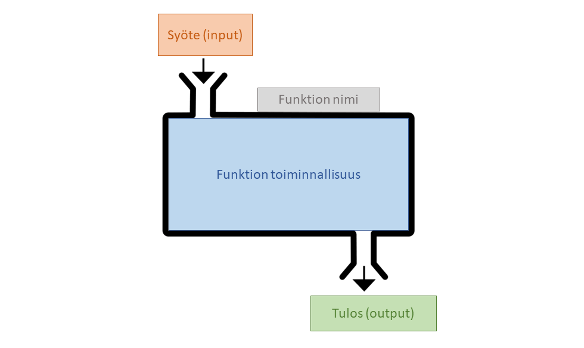
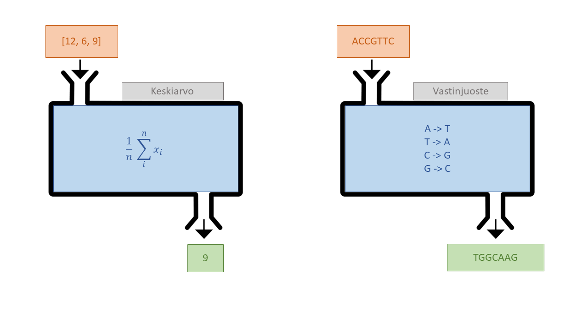
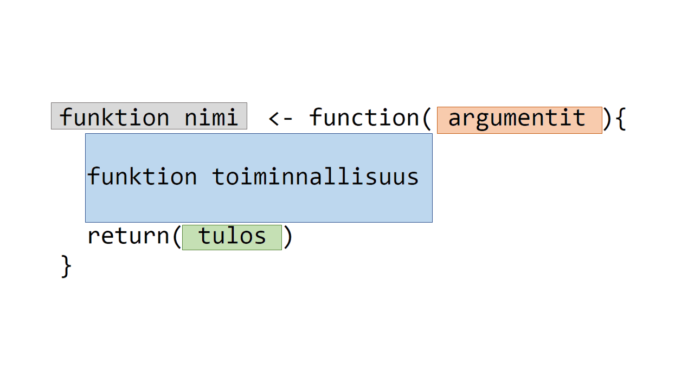

Tällä viikolla opitaan kirjoittamaan itse funktioita ja pureudutaan sitä kautta syvemmälle R-funktioiden toimintaan. 


## Funktion käsite

Funktio on kokonaisuus järjesteltyä ja uudelleenkäytettävää koodia, jonka tarkoitus on suorittaa yksi tarkkaan määrätty tehtävä. Funktioilla on syöte (input) ja tulos (output). Funktion tehtävä on palauttaa (return) syötteen perusteella haluttu tulos. Alla olevassa kuvassa näkyvät funktion neljä osaa: nimi, syöte, toiminnallisuus ja tulos.



Otetaan esimerkiksi kaksi funktiota: "Keskiarvo" ottaa syötteenä halutun määrän lukuja, ja laskee niiden keskiarvon. "Vastinjuoste" ottaa syötteenä DNA-juosteen ja palauttaa sen vastinjuosteen.



Funktioilla voi olla myös erityyppisiä syötteitä, voitaisiin esimerkiksi määritellä funktio, jolle annettaisiin syötteenä henkilön ikä, pituus, paino, sekä elintapatietoja, ja funktio laskisi näiden pohjalta eliniänodotteen. 

## R-funktiot

### Funktioiden määrittely

Tähän mennessä olemme jo käyttäneet monia R-funktioita eikä meidän ole tarvinnut miettiä niiden toimintaa kovin syvällisesti. Virhetilanteet on kuitenkin paljon helpompi ratkaista, kun ymmärtää miten funktiot toimivat R:ssä.

R-funktioita luodaan ```function```-komennolla. Funktion rakennus näyttää tältä:



R-funktiot siis koostuvat samoista osista kuin yllä esitellyt funktiot.
- Funktion nimi on muuttuja, johon funktio tallennetaan.
- Funktion syöte koostuu argumenteista
- Funktion toiminnallisuus on R-koodia
- Funktion tulos palautetaan komennolla ```return()```

Tehdään esimerkiksi funktio BMI:n laskemiseen:

```{r}
# Define function name and arguments
bmi <- function(height, mass) {
  # Compute BMI
  value <- mass / height^2
  rounded <- round(value, digits = 1)
  # Return computed value
  return(rounded)
}
```

Ensimmäisellä riville määritellään muuttuja, johon funktio tallennetaan, eli funktion nimi. Lisäksi määritetään funktion argumentit, tässä tapauksessa pituus ja paino. Itse funktion koodi tulee hakasulkeiden sisään seuraaville riveille. Ensimmäinen koodirivi laskee BMI:n ja toinen pyöristää tuloksen yhden desimaalin tarkkuuteen. Kolmas rivi palauttaa sen.

Voimme nyt kutsua (call) funktiotamme aivan kuin muitakin R-funktioita:

```{r}
# Example
my_bmi <- bmi(height = 1.79, mass = 74)

my_bmi
```

HUOM: palautettava arvo on ainoa asia, joka välittyy funktion ulkopuolelle. Koska funktiomme palauttaa pyöristetyn arvon, alkuperäiseen arvoon ei pääse funktion ulkopuolelta käsiksi.

```{r, eval=FALSE}
my_bmi <- bmi(height = 1.90, mass = 95)
# Throws error
value
```

Funktioiden sisällä luodut muuttujat ovat siis olemassa vain sen sisällä ja lakkaavat olemasta, kun funktion suoritus lakkaa.


### Argumentit ja funktion kutsuminen

R:ssä funktioiden argumentteja voi määritellä eri tavoilla, mutta yleisimmässä tapauksessa funktioilla on tietty määrä nimettyjä argumentteja. Edellisen esimerkin bmi-funktiolla on kaksi argumenttia, pituus ja paino. R-kunktioita voi kutsua monella eri tavalla, ja tutustutaan tähän lisää tämän yksinkertaisen funktion avulla.

Yksi tapa on kutsua funktiota antamalla argumenttien arvot ilman niiden nimiä. HUOM: jos argumentteja ei nimeä, niiden tulee olla oikeassa järjestyksessä. Alla olevan esimerkin toisessa kohdassa argumentit menevät sekaisin.

```{r}
# Call without argument names
bmi(1.65, 62)
# Arguments in wrong order -> weird results / error
bmi(62, 1.65)
```

Argumentit voi myös nimetä, kuten edellisissä esimerkeissä tehtiin. Tällöin järjestyksellä ei ole väliä, koska funktiolle on selvää, mitä argumenttia tarkoitetaan.

```{r}
bmi(height = 1.65, mass = 62)
bmi(mass = 62, height = 1.65)
```

On myös mahdollista nimetä vain osa argumenteista. Tällöin nimeämättömät argumentit asetetaan argumenteiksi "tyhjiin kohtiin" vasemmalta oikealle. 

```{r}
bmi(1.65, mass = 62)
bmi(62, height = 1.65)
```

Jos funktioille yritetään antaa argumentteja, joita ei ole määritelty, seuraa virhe:

```{r, eval=FALSE}
# Causes error
bmi(height = 1.65, weight = 62)
```

Samoin jos jokin argumentti puuttuu, seuraa virhe:

```{r, eval=FALSE}
# Causes error
bmi(height = 1.65)
```


HUOM: vaikka argumentit saa antaa haluamassaan järjestyksessä ja nimettynä tai nimeämättömänä, kannattaa kuitenkin olla johdonmukainen. Yleisohjeena argumentit kannattaa aina nimetä ja pyrkiä antamaan siinä järjestyksessä, kuin ne on funktiossa määritelty. Näin koodin lukeminen ja ylläpito on paljon helpompaa. Poikkeuksena sääntöön ovat funktiot, joiden toiminta on yksinkertaista, tai joiden ensimmäiset argumentit ovat niin tunnettuja, että niitä ei ole syytä nimetä.

Otetaan esimerkiksi funktio ```seq()```. Jos avaat funktion help-sivun komennolla ```?seq```, näet, että ensimmäiset argumentit ovat nimeltään ```from``` ja ```to```. Koska ```seq``` on hyvin yleinen ja tunnettu, ja ```from``` ja ```to``` on pakko määrittää, sitä kutsutaan yleensä niin, että ```from``` ja ```to``` jätetään nimeämättä. Muut argumentit, kuten ```by``` ja ```length.out``` yleensä nimetään, koska niitä ei aina käytetä, eikä voida olettaa koodin lukijan muistavan, mitä argumenttia tarkoitetaan, vaikka ```seq``` toimisi ilman nimiä, jos annettaisiin peräkkäin ```from```, ```to``` ja ```by```. Vastaavasti ```plot```-komennon tapauksessa ei aina kirjoiteta nimiä ```x``` ja ```y```-argumenteille, mutta väriä yms. ohjaavat argumentit nimetään.

#### Oletusarvot (default values)

Monilla R-funktioilla on paljon argumentteja, joista kaikkia ei kuitenkaan tarvitse määrittää erikseen, vaan niillä on oletusarvoja (default values). Esimerkiksi ```seq()``` tekee oletuksena vektorin, jossa on kaikki kokonaisluvut ```from```-argumentista ```to```-argumenttiin. Tätä käyttäytymistä voi kuitenkin muuttaa ```by``` ja ```length.out```-argumentteja säätämällä.

Tehdään nyt omaan bmi-funktioomme uusi argumentti ```height_multiplier```, joka on oletuksena 1. Jos kuitenkin halutaan antaa pituus senttimetreissä metrien sijaan, voidaan asettaa korkeuden kertoimeksi 0.01.

```{r}
bmi <- function(height, mass, height_multiplier = 1) {
  # Compute BMI
  value <- mass / (height * height_multiplier)^2
  rounded <- round(value, digits = 1)
  # Return computed value
  return(rounded)
}
bmi(height = 1.65, mass = 62)
bmi(height = 165, mass = 62, height_multiplier = 0.01)
```

Argumentin oletusarvo merkataan siis funktion määrittelyssä ```=```-merkillä, kuten funktion argumenttien anto yleensä. Tämä on hyvä tietää omia funktioita tehdessä, mutta myös valmiiden funktioiden käytössä: jos argumentille ei ole funktion help-sivulla annettu vakioarvoa, se on pakko antaa, tai muuten seuraa virhe, kuten aikaisemmin kävi. Monilla valmiiden funktioiden argumenteilla on oletusarvona tyhjä arvo eli ```NULL```. Tämä tarkoittaa usein, että argumentin voi jättää tyhjäksi, mutta oletusarvon valinta on niin monimutkainen prosessi, että sitä ei voi kirjoittaa funktion määrittelyssä yhdelle riville. Usein tämä tarkoittaa sitä, että oletusarvo riippuu muista argumenteista. HUOM: ```NULL``` on eri asia kuin ```NA```, ja käyttäytyy eri tavoin. Aiheesta lisää [täällä](https://www.r-bloggers.com/r-na-vs-null/).

### Funktio ilman argumentteja

Joillain funktioilla ei ole ollenkaan argumentteja. Esimerkiksi R:n sisäiset funktiot ```Sys.time()``` ja ```Sys.Date()``` palauttavat tämänhetkisen ajan ja päivän, eivätkä tarvitse argumentteja.

```{r}
Sys.time()
```


Itse tehdyt funktiot voivat myös toimia ilman argumentteja. Niitä käytetään usein R-istunnon tilan, koodia ajavan tietokoneen ominaisuuksien tai ajan selvittämiseen. Tämä melko hyödytön esimerkkifunktio palauttaa tämän dokumentin kirjoittajan nimen:

```{r}
author <- function() {
  return("Anton Klåvus")
}
author()
```


## Arvojen palautus

Tutkitaan arvojen palautusta R-funktiosta hieman enemmän.

### Usean arvon palautus

R-funktiot palauttavat aina yhden arvon. Palautukseen käytetään funktiota ```return()```, kuten aiemmin nähtiin. R-funktio voi palauttaa vain yhden arvon, toisin kuin joissain muissa ohjelmointikielissä. Jos funktiosta halutaan ulos useampi arvo, ne on pakattava esim. listaan. Jos siis ```bmi```-funktiosta haluttaisiin palauttaa sekä pyöristetty, että alkuperäinen BMI:n arvo, voidaan ne palauttaa listassa:

```{r}
bmi_list <- function(height, mass, height_multiplier = 1) {
  # Compute BMI
  value <- mass / (height * height_multiplier)^2
  rounded <- round(value, digits = 1)
  # Return computed value
  values <- list(original = value,
                 rounded = rounded)
  return(values)
}
result <- bmi_list(1.65, 62)
result
result$rounded
```

### Palautus ilman return-käskyä

R on siitä erikoinen ohjelmointikieli, että R-funktiot voivat palauttaa arvoja myös ilman eksplisiittistä ```return```-käskyä. Jos R-funktiossa ei ole ```return```-käskyä, ja viimeinen rivi on vain muuttuja, tai sijoitus muuttujaan, tämän muuttujan arvo palautetaan automaattisesti. ```bmi```-funktion voisi siis kirjoittaa myös näin:

```{r}
bmi <- function(height, mass, height_multiplier = 1) {
  # Compute BMI
  value <- mass / (height * height_multiplier)^2
  rounded <- round(value, digits = 1)
  # Return computed value
  rounded
}
bmi(1.65, 62)
```

Alussa on kuitenkin hyvä käyttää ```return```-käskyä, niin pysyy paremmin perässä siitä, mitä koodi tekee, eikä sen kirjoittaminen ole kokeneellekaan ohjelmoijalle huono tapa.


### Funktio ilman tulosta

Moni funktio ei palauta yhtään mitään. Yleisiä esimerkkejä ovat ```cat()``` ja ```plot()```, jotka tulostavat ja piirtävät asioita, mutta eivät palauta mitään. Jos näiden funktion paluuarvon yrittää sijoittaa muuttujaan, on tuloksena ```NULL```, eli tyhjä arvo. 

```{r}
cat_return <- cat("What does cat return?\n")
cat_return
```

Itse tehty funktio palauttaa ```NULL```, jos viimeinen komento palauttaa ```NULL```:

```{r}
# Function for plotting blue squares
blue_squares <- function(x, y) {
  plot(x, y, pch = 3, col = "blue")
}
value <- blue_squares(1:5, c(2, 5, 3, 3, 8))
value
```


