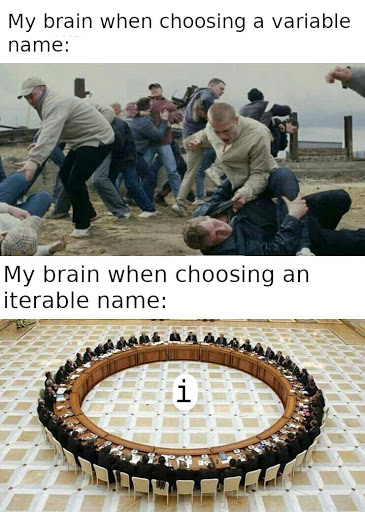

Toistorakenne toistaa annettua koodia. Toistorakenteet ovat ehtorakenteiden ohella ohjelmoinnin perusrakennuspalikoita. Tässä osiossa tutustutaan kahteen yleisimpään tapaukseen eli for ja while -silmukoihin. Mukana on myös maininta silmukoiden korvaamisesta R:n apply-funktioilla. Lopusta löytyy lisäksi vinkkejä tämän viikon tehtäviin.

Lisäksi tällä viikolla puhutaan [R-paketeista](https://github.com/antonvsdata/r_intro/blob/master/viikko_7/packages.md).

## For-silmukka

For-silmukka toistaa koodia ennalta määrättyjen iteraatioiden verran. For-silmukalla voi esimerkiksi käydä läpi data framen tai matriisin sarakkeita tai rivejä, tai vektorin arvoja. For-silmukka iteroi aina jonkin vektorin arvojen yli: for-silmukalle siis annetaan siis vektori arvoja, ja ns. iteraatiomuuttuja, johon tallennetaan vuorotellen yksi alkio annetusta vektorista. Käytännössä tämä näyttää tältä:

```{r}
for (i in seq(3, 7)) {
  print(i)
}
```

for-silmukassa määritetään siis ensin iteraatiomuuttuja eli ```i``` ja sen saamat arvot eli ```seq(3, 7)``` komennolla ```in```. Sen jälkeen hakasulkeiden sisältämä koodi toistetaan jokaiselle ```i```:n arvolle. Tässä tapauksessa yksinkertaisesti tulostetaan muuttujan ```i``` arvo.

Usein halutaan kuitenkin käydä läpi jonkin vektorin tai matriisin arvoja. Alla oleva koodi laskee matriisin X rivien summan (tähän voisi myös käyttää valmista funktiota ```rowSums()```). Aluksi alustetaan tyhjä vektori, johon rivien summat tallennetaan. Sen jälkeen käydään läpi matriisin rivit ja tallennetaan rivin summa alussa alustettuun vektoriin.

```{r}
# Create matrix X
X <- matrix(1:12, nrow = 4)
X

# Initialize vector for row sums
row_sums <- rep(0, nrow(X))
# Iterate over rows of X
for (i in seq(1, nrow(X))) {
  # Assign sum of the current row to the vector
  row_sums[i] <- sum(X[i, ])
}

# Compare results with the result from base R function
row_sums
rowSums(X)
```

For-silmukalla voi myös toteuttaa viime kerralla tehdyn funktion, joka poimii DNA:n emäksistä vain sytosiinit ja guaniinit. Tällä kertaa apufunktiota ```is_cg()``` ei tarvitse vektorisoida, koska for-silmukka käy läpi kaikki emäkset. Tämä silmukka voidaan toteuttaa kahdella tavalla. Ensimmäinen tapa on käyttää iteraatiomuuttujana i:tä, joka käy läpi iteraation ykkösestä emäsvektroin pituuteen:


```{r}
# Helper function
is_cg <- function(base) {
  if (base %in% c("C", "G")) {
    return(TRUE)
  } else {
    return(FALSE)
  }
}

# Main function
pick_cg1 <- function(bases) {
  # Initialize empty vector
  only_cg <- c()
  for (i in seq(1, length(bases))) {
    # If the current base is C or G, add it to only_cg
    if (is_cg(bases[i])) {
      only_cg <- c(only_cg, bases[i])
    }
  }
  
  return(only_cg)
}

my_bases <- c("A", "C", "C", "T", "G", "T")
pick_cg1(my_bases)
```

Toinen vaihtoehto on iteroida suoraan vektorin bases yli, jolloin iteraatiomuuttujaan tallentuu suoraan kyseinen emäs:

```{r}
pick_cg2 <- function(bases) {
  # Initialize empty vector
  only_cg <- c()
  for (base in bases) {
    # If the current base is C or G, add it to only_cg
    if (is_cg(base)) {
      only_cg <- c(only_cg, base)
    }
  }
  
  return(only_cg)
}

my_bases <- c("A", "C", "C", "T", "G", "T")
pick_cg2(my_bases)
```

Iteraatiomuuttujan voi siis nimetä haluamallaan tavalla, sen ei aina tarvitse olla i. Jos kuitenkin iteraatiomuuttujaan tallennetaan vain yksi luku, suosittelen vahvasti käyttämään i:tä. Tämä on hyvin vakiintunut tapa ohjelmointikielestä ja ohjelmoijasta riippumatta, vaikka muutoin muuttujien nimeämiseen on erilaisia koulukuntia riippuen ohjelmoijan taustasta. Jos taas iteroidaan vektorin nimeltä bases yli, on luonnollinen valinta iteraatiomuuttujan nimeksi base.



## While-slimukat

While-silmukkaa käytetään, kun iteraatioiden määrä ei ole ennalta tiedossa, vaan while-silmukkaa toistetaan niin kauan, kuin tietty ehto on voimassa. Hyvä esimerkki while-loopista on proteiinisynteesi (yksinkertaistettuna): alla oleva funktio käy läpi RNA-molekyylin kodoneita, kunnes löytää aloituskodonin AUG. Sen jälkeen funktio rakentaa aminohappoketjua kodonien perusteella, kunnes vastaan tulee jokin lopetuskodoneista. Oikean proteiinin löytämiseen käytetään Biostrings-paketista löytyvää geneettistä koodia, joka on nimetty vektori, jossa on kodoneita vastaavien aminohappojen kirjainlyhenne, tai lopetuskodonien tapauksessa merkki "*":

```{r}
rna_code <- Biostrings::RNA_GENETIC_CODE
rna_code
```


```{r}
prot_synth <- function(codons) {
  # Initialize iterable as the first codon
  i <- 1
  # Initialize empty amino acid chain
  protein <- c()
  # Find starting codon
  while (codons[i] != "AUG") {
    i <- i + 1
  }
  # After starting codon, build protein until one of the stop codons is met
  while (rna_code[codons[i]] != "*") {
    protein <- c(protein, rna_code[codons[i]])
    i <- i + 1
  }
  return(protein)
}

prot_synth(codons = c("UUG", "GAA", "AUG", "UGU", "AGU", "AGA", "UCG", "UCG", "UGA", "GCA"))
```

While silmukalle annetaan siis ensin ehto, joka tarkistetaan ennen jokaista iteraatiota. Jos ehto täyttyy, suoritetaan yksi iteraatio, ja tarkistetaan ehto uudestaan. HUOM: while-silmukan sisällä pitää itse kasvattaa iteraatiomuuttujaa, muuten silmukka saattaa jäädä pyörimään ikuisesti!

Käytännössä kaikki for-silmukat voisi korvata while-silmukoilla, mutta for-silmukoiden käyttö on kätevämpää, sillä niissä iteraatiomuuttujaa tarvitse kasvattaa erikseen.

```{r}
# A simple for loop
for (i in seq(1, 4)) {
  print(i * 2)
}

# The same as above
i <- 1
while (i <= 4) {
  print(i * 2)
  i <- i + 1
}
```

## Sisäkkäiset silmukat (nested loops)

Silmukoita voi myös olla useampi sisäkkäin. Alla olevassa esimerkissä on taulukko tutkimuksesta, jossa on mitattu eri eliöiden $\beta$- globiinigeenin ensimmäisen eksonin samankaltaisuutta. Pienempi luku tarkoittaa enemmän samankaltaista geeniä.

```{r, echo=FALSE}
exons <- read.csv("exons.csv", row.names = 1)
knitr::kable(exons)
```

Tämä data on tiedostossa exons.csv, joten luetaan se R:ään:

```{r}
exons <- read.csv("exons.csv", row.names = 1)
```

Etsitään seuravaksi kaikki eliöparit, joiden geenien etäisyys on alle 4 ja lisätään parit data frameen, jossa on kaksi saraketta, ja jokainen rivi edustaa yhtä eliöparia. Käytetään tähän kahta sisäkkäistä for-silmukkaa. Toisen silmukan iteraatiomuuttujan nimi on yleensä j, seuraavan k ja niin edelleen. Käydään exons läpi niin, että i on rivin numero, ja j sarakkeen numero, ja etsitään sopivat parit.


```{r}
# Initialize empty data frame for the pairs
close_pairs <- data.frame()

# Iterate over rows and columns
for (i in seq(1, nrow(exons))) {
  for (j in seq(1, ncol(exons))) {
    # Check if dissimilarity is below 4
    if (exons[i, j] < 4) {
      # Add the pair as a new row to close_pairs
      new_row <- data.frame(Species_1 = rownames(exons)[i],
                            Species_2 = colnames(exons)[j])
      close_pairs <- rbind(close_pairs,
                           new_row)
    }
  }
}

close_pairs
```

Koodimme toimii jo ihan hyvin, mutta tuloksessa on hieman turhaa tavaraa: exons on symmetrinen, joten monet parit on esitetty tuloksessa kahdesti. Tämä voidaan ratkaista muuttamalla toista for-silmukkaa:

```{r}
# Initialize empty data frame for the pairs
close_pairs <- data.frame()

# Iterate over rows and columns
for (i in seq(1, nrow(exons))) {
  # Only check upper diagonal
  for (j in seq(i, ncol(exons))) {
    # Check if dissimilarity is below 4
    if (exons[i, j] < 4) {
      # Add the pair as a new row to close_pairs
      new_row <- data.frame(Species_1 = rownames(exons)[i],
                            Species_2 = colnames(exons)[j])
      close_pairs <- rbind(close_pairs,
                           new_row)
    }
  }
}

close_pairs
```

Nyt toisen silmukan läpi käymät j:n arvot riippuvat i:n arvosta. Tämä koodi käy läpi taulukon ylemmän diagonaalin, eli "yläpuolen". Ensimmäisellä kierroksella j käy läpi arvot 1-7, seuraavalla kierroksella 2-7, sitten 3-7 jne. Vastaavasti voitaisiin myös käydä läpi alempi diagonaali komennolla ```for(j in seq(1, i)```.

Emme kuitenkaan voi olla vieläkään tyytyväisä tulokseen, sillä mukana ovat "parit", joissa kumpikin laji on sama. Näistä emme luonnollisesti ole kiinnostuneita. Nämä parit voidaan poistaa esimerkiksi ````next```-komennolla.

## Iterointiin puuttuminen: next ja break

Joskus silmukan toimintaan on hyvä puuttua kesken suorituksen. Joskus yksi iteraatio halutaan sivuuttaa kokonaan, toisinaan taas halutaan keskeyttää iteraatio kokonaan. Näihin tarkoituksiin R:ssä on komennot ```next``` ja ```break```.

Lisätään edelliseen esimerkkiin toiminto, joka ohittaa diagonaalilla olevat rivit, eli hyppää iteraation yli, jos i ja j ovat yhtä suuret. Käytetään tähän ```next```-komentoa, joka ohjaa ohjelman suoraan seuraavaan iteraatioon:


```{r}
# Initialize empty data frame for the pairs
close_pairs <- data.frame()

# Iterate over rows and columns
for (i in seq(1, nrow(exons))) {
  # Only check upper diagonal
  for (j in seq(i, ncol(exons))) {
    if (i == j) {
        next
    }
    # Check if dissimilarity is below 4
    if (exons[i, j] < 4) {
      # Add the pair as a new row to close_pairs
      new_row <- data.frame(Species_1 = rownames(exons)[i],
                            Species_2 = colnames(exons)[j])
      close_pairs <- rbind(close_pairs,
                           new_row)
    }
  }
}

close_pairs
```

Nyt pääsimme eroon kaikista turhista pareista! 

Jos haluaisimme kaikkien parien sijaan etsiä vain ensimmäisen parin, jonka geenien etäisyys on alle 3, voisimme käyttää komentoa ```break```, joka keskeyttää silmukan suorittamisen turhaan haluamamme parin löydyttyä.

```{r}
close_pair <- c()

# Iterate over rows and columns
for (i in seq(1, nrow(exons))) {
  # Only check upper diagonal
  for (j in seq(i, ncol(exons))) {
    if (i == j) {
        next
    }
    # Check if dissimilarity is below 3
    if (exons[i, j] < 3) {
      # Assign pair to close_pair and stop search
      close_pair <- c(Species_1 = rownames(exons)[i],
                            Species_2 = colnames(exons)[j])
      break
    }
  }
}

close_pair
```

HUOM: Tämä ei kuitenkaan ole oikea pari: Jos exons data framea käydään läpi rivi kerrallaan, ensimmäinen pari, jonka arvo on alle 3 on Human ja Lemur, ei Mouse ja Gorilla. Mikä siis meni väärin? Kun kyse on näin pienestä aineistosta, voidaan mahdollisia ongelmia tutkia lisäämällä silmukoiden sisään ```print()```-komentoja, jotka kertovat meille silmukan etenemisestä. Lisätään siis edelliseen silmukkaan rivi, joka tulostaa iteraatiomuuttujat i ja j jokaisella iteraatiolla, sekä rivi, joka tulostaa uuden parin, kun sellainen löytyy:

```{r}
close_pair <- c()

# Iterate over rows and columns
for (i in seq(1, nrow(exons))) {
  # Only check upper diagonal
  for (j in seq(i, ncol(exons))) {
    # Monitor loop
    print(c(i, j))
    if (i == j) {
        next
    }
    # Check if dissimilarity is below 3
    if (exons[i, j] < 3) {
      # Assign pair to close_pair and stop search
      close_pair <- c(Species_1 = rownames(exons)[i],
                            Species_2 = colnames(exons)[j])
      print(close_pair)
      break
    }
  }
}

close_pair
```

Nyt huomataan, että iteraatio etenee rivillä yksi neljänteen sarakkeeseen asti, ja löytää parin Human-Lemur, aivan kuten pitikin. Jostain syystä ohjelma siirtyy kuitenkin sen jälkeen toiselle riville. Tämä johtuu siitä, että ```break```-komento katkaisee vain yhden for-silmukan kerrallaan. Jos haluamme katkaista myös ulomman silmukan, meidän tulee lisätä ulomman silmukan loppuun tarkastus, joka tarkastaa, onko pari jo löytynyt. Tämä voidaan testata esimerkiksi vektorin close_pairs pituuden avulla. Jos if-rakenteelle antaa pelkän luvun, luku tulkitaan arvoksi TRUE, jos se ei ole nolla.

```{r}
close_pair <- c()

# Iterate over rows and columns
for (i in seq(1, nrow(exons))) {
  # Only check upper diagonal
  for (j in seq(i, ncol(exons))) {
    if (i == j) {
        next
    }
    # Check if dissimilarity is below 3
    if (exons[i, j] < 3) {
      # Assign pair to close_pair and stop search
      close_pair <- c(Species_1 = rownames(exons)[i],
                            Species_2 = colnames(exons)[j])
      break
    }
  }
  # Stop iterating if the pair has been found
  if (length(close_pair)) {
    break
  }
}

close_pair
```

Nyt koodimme toimii, kuten pitääkin!

## Apply-funktiot

R:ssä käytetään silmukoiden lisäksi ```apply()```-funktioperheen funktioita, joilla voi käydä läpi data frameja, matriiseja tai vektoreita ilman silmukoita. Joissain tapauksissa ```apply```-funktiot ovat myös nopeampia kuin silmukat. Tästä syystä niitä näkee käytettävän paljon, ja varsinkin kokeneemmat R-ohjelmoijat käyttävät niitä paljon. Tällä kurssilla näitä funktioita ei kuitenkaan tarvita. Tässä on annettu muutamia esimerkkejä, voit lukea lisää esimerkiksi [DataCampin tutoriaalista](https://www.datacamp.com/community/tutorials/r-tutorial-apply-family)

```apply()``` käy läpi matriisin/data framen rivit tai sarakkeet, ja ajaa jonkin funktion jokaiselle riville tai sarakkeelle. Alla oleva esimerkki normalisoi kaikki R:n sisäisen datan trees sarakkeet autoscaling-menetelmällä, jossa sarakkeen arvoista vähennetään sarakkeen keskiarvo ja tulos jaetaan sarakkeen keskihajonnalla. Normalisoinnin tarkoitus on, että kaikkien sarakkeiden keskiarvoksi saadaan 0, ja kaikilla on sama varianssi (ja keskihajonta) 1.

```{r}
head(trees)

scaler <- function(x) {
  scaled <- (x - mean(x)) / sd(x)
  scaled
}

scaled_trees <- apply(X = trees, MARGIN = 2, FUN = scaler)
scaled_trees <- as.data.frame(scaled_trees)
head(scaled_trees)
```

MARGIN-argumentilla määritetään, käydäänkö läpi rivit vai sarakkeet (1 = rivit, 2 = sarakkeet). HUOM: ```apply``` palauttaa aina matriisin tai vektorin. Jos tulos halutaan muuntaa takaisin data frameksi, täytyy se tehdä erikseen.

Tarkistetaan tulos laskemalla sarakkeiden keskiarvot ja varianssit. Tämä voidaan tehdä ```apply```-funktiolla, tai käyttää ```sapply```-funktiota, joka käy automaattisesti data framen sarakkeet, ja ajaa saman funktion sarakkeille kuten ```apply```. ```sapply```-komennon funktion on pakko palauttaa vain yksi arvo, sillä ```sapply``` kokoaa automaattisesti tuloksensa vektoriin.

```{r}
apply(scaled_trees, 2, mean)
sapply(scaled_trees, var)
```

Huomaa, että sarakkeiden keskiarvot eivät ole tismalleen 0. Tämä johtuu R:n rajallisesta numeerisesta tarkkuudesta. Käytännössä itseisarvoltaan tätä luokkaa olevat arvot ovat nollia.

## Vinkkejä tehtäviin

Tämän viikon tehtävissä pitää muokata funktioita, jotka ovat erillisissä tiedostoissa. Jotta tehtävän palautus onnistuu, funktio pitää muokata tässä tiedostossa. Funktio kannattaa kuitenkin kopioida talteen toiseen tiedostoon, sillä tehtävän palauttaminen pyyhkii tiedoston.

