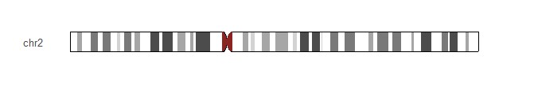
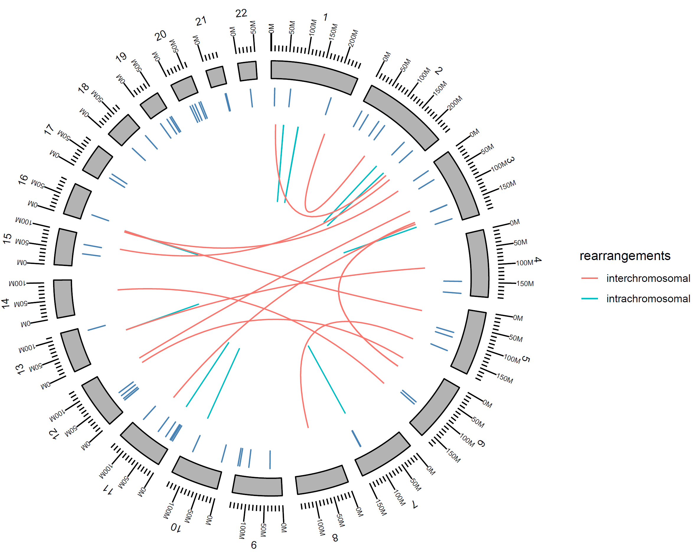

# R-paketit

Käytännön R-ohjelmointi nojaa tällä kurssilla esiteltyjen rakenteiden lisäksi hyvin pitkälti erilaisten pakettien käyttöön. Paketit ovat kooodikokoelmia, jotka sisältävät uusia funktioita, luokkia ja dataa eli ne laajentavat R:ää. 

## Pakettien asennus

Useimmat R-paketit ovat CRANissa (Comprehensive R Archive Network). Ne voidaan asentaa komennolla ```install.packages()```, tai RStudion asennusikkunan kautta, jota käytimmekin jo aikaisemmin ja joka käytännössä kutsuu ```install.packages()```-funktiota . Käyttämällä funkiot asuoraan voi myös asentaa useamman paketin kerralla. Alla oleva komento asentaa dplyr- ja tidyr-paketit:


```{r, eval=FALSE}
install.packages(c("dplyr", "tidyr"))
```


## Pakettien käyttö

Jotta R-paketin sisältämät komennot saa käyttöön, paketti pitää ladata ja liittää R-työtilaan. Tämä tapahtuu komennolla ```library()```:

```{r, warning=FALSE, message=FALSE}
library(tidyr)
```


Nyt kun tidyr on ladattu, voimme käyttää siinä olevia komentoja, joilla voi hallita data frame-muodossa olevaa dataa erittäin kätevästi. Otetaan esimerkiksi data tiedostosta drug_data.csv

```{r}
drug_data <- read.csv("drug_data.csv")
drug_data
```

Tässä datassa on kuviteltu tutkimus, jossa tutkitaan antibiootin tehoa, eli sitä, kuinka hyvin lääke laskee tulehdukesn markkereita: CRP ja Prokalsitoniini (PCT). Kumpikin markkeri on mitattu alkutilanteessa (0) sekä yhden (1) ja kahden (2) päivän hoidon jälkeen. Kuvitellaan nyt, että tämä data haluttaisiin syöttää lineaariseen malliin, jolla ennustettaisiin CRP:n tasoa aikapisteen perusteella. Miten muotoilisit tällaisen mallin R:llä?

Aivan, mallin pitäisi näyttää tältä: ```lm(CRP ~ Time, data = drug_data)```. Mutta datassa on tällä hetkellä CRP-arvoja kolmessa eri sarakkeessa, joita R luulee kolmeksi erilliseksi muuttujaksi! Dataa pitää siis muokata niin, että kaikki CRP- ja PCT-arvot ovat omissa sarakkeissaan, ja aikapistetiedot omassa sarakkeessaan. Tätä varten voisimme luoda uuden data framen, ja kehitellä jonkinlaisen silmukan, joka käy läpi alkuperäistä dataa ja poimii siitä arvoja oikeaan muotoon. Tämä on kuitenkin työlästä.

Onneksi asia on helppo korjata tidyr-paketin komennoilla. HUOM: tämän koodin toimintaa ei käsitellä tässä sen enempää, eikä sitä tarvitse ymmärtää. Tarkoitus on demonstroida sitä, kuinka monimutkaiselta tuntuva asia saadaan hoidettua kahdella koodirivillä, kun käytössä on oikea paketti.

```{r}
drug_data %>%
  pivot_longer(-Subject, names_to = c("Var", "Time"), names_pattern = "(.*)_(.)", values_to = "Value") %>%
  pivot_wider(names_from = "Var", values_from = "Value")
```

Jos koko pakettia ei halua ladata ja liittää, voi paketeista käyttää yksittäisiä komentoja käyttämällä muotoa ```paketti::komento()```. Esimerkiksi tällä kurssilla käytetty komento ```Rkurssi::Rkurssi()``` ajaa paketista Rkurssi samannimisen funktion Rkurssi. Kahden kaksoispisteen notaatiota voi käyttää myös silloin, jos kahdessa paketissa on samanniminen funktio ja haluaa varmistaa, että käyttää varmasti oikeaa funktiota.


## Bioconductor

Bioinformaatikko törmää aikaisemmin tai myöhemmin Bioconductoriin. Bioconductorissa on paljon erilaisia työkaluja bionformaatikoille, mm. R-paketteja. Bioconductorin paketit asennetaan eri komennolla kuin muut R-paketit, mutta asennusohjeet on onneksi aina annettu paketin yhteydessä. Esimerkiksi [ggbio-paketin](http://bioconductor.org/packages/release/bioc/html/ggbio.html) asennus tehdään näin:

```{r, eval=FALSE}
if (!requireNamespace("BiocManager", quietly = TRUE))
    install.packages("BiocManager")

BiocManager::install("ggbio")
```

Ensimmäinen osa koodista tarkistaa, onko BiocManager-paketti asennettu, ja jos ei, asentaa sen. BiocManager-pakettia käytetään Bioconductorin pakettien asennukseen. Toinen osa asentaa BiocManagerin avulla ggbio-paketin.

ggbio-paketilla voi visualisoida genomiikka-dataa. Ladataan ensin ggbio-paketti. Käydään sitten läpi muutama esimerkki ggbio-paketin toiminnallisuudesta (kopioitu paketin esimerkeistä).

```{r, warning=FALSE, message=FALSE}
library(ggbio)
```

Ideogrammi toisesta ihmisen kromosomista saadaan yhdellä koodirivillä:

```{r, eval = FALSE}
p_ideo <- Ideogram(genome = "hg19", subchr = "chr2")
p_ideo
```


Alla on monimutkaisempi esimerkki, jossa visualisoidaan somaattisia mutaatioita ihmisen genomissa (tarkemmat tiedot löytyvät ggbio-paketin dokumentaatiosta). Tässä esimerkissä koodia on jo aikalailla, mutta tämä esimerkki löytyy suoraan paketin dokumentaatiosta, jolloin samankaltaisten kuvaajien piirtäminen omalla datalla on melko suoraviivaista.

```{r, out.width="100%", eval = FALSE}
data("CRC", package  = "biovizBase")
gr.crc1 <- crc.gr[crc.gr$individual == "CRC-1"]

p <- ggbio() +
  circle(gr.crc1, geom = "link", linked.to = "to.gr", aes(color = rearrangements)) +
  circle(mut.gr, geom = "rect", color = "steelblue") +
  circle(hg19sub, geom = "ideo", fill = "gray70") +
  circle(hg19sub, geom = "scale", size = 2) +
  circle(hg19sub, geom = "text", aes(label = seqnames), vjust = 0, size = 3)
p
```



## Pakettien käyttöön tarvittavat taidot

Kuten aiemmin mainittiin, R-pakettien käyttö aloitetaan usein lukemalla paketin tekijöiden esimerkkikoodia, ja muokkaamalla sitä omiin tarpeisiin sopivaksi. Tätä varten pitää ymmärtää tällä kurssilla opittuja asioita:

- Funktion käsite: mikä funktio on ja miten se toimii
- Argumentit: miten funktiolle annetaan argumentteja? Tämä on erittäin tärkeää, sillä muuten on vaikea ymmärtää, mitä osaa esimerkkikoodista tulisi muokata, jotta se toimii omalla datalla.
- Dokumentaation lukeminen: ?funktion_nimi antaa syvempää tietoa funktiosta ja sen toiminnasta, ja dokumentaation ymmärtäminen on usein pakollista, jos haluaa käyttää funktiota omiin tarkoituksiinsa.


