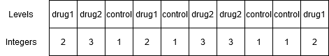

  
# Lineaariset mallit ja tilastolliset jakaumat
  
Tässä osiossa tutustutaan lineaarisiin malleihin ja yleisimpien jakaumien käyttöön R:ssä. Jos konseptit eivät ole tilastotieteen kursseilta tuttuja, ei hätää: tämä dokumentti sisältää lyhyet selitykset tärkeimmistä konsepteista, ja loput selitetään varsinaisilla tilastotieteen kursseilla.

Ennen kuin puhutaan tilastollisten testien tekemisestä R:llä, on hyvä tutustua factor-luokan vektoreihin

## Factor-vektorit

R:ssä on aiemmin nähtyjen numeric, character ja logical-vektorien lisäksi muitakin vektoriluokkia, tärkeimpänä näistä factor. Factor-vektoreihin tallennetaan kategorisia muuttujia, kuten tutkimuksessa määrättyjä ryhmiä, aikapisteitä tms. Luodaan esimerkiksi factor-vektori, jossa on kuvitteellisen lääketutkimuksen osallistujien ryhmätiedot:
  
```{r}
groups <- as.factor(c("drug1", "drug2", "control", "drug1", "control",
                      "drug2", "drug2", "control", "control", "drug1"))
groups
```

Factoreita voi luoda muista vektoreista funktioilla ```factor``` tai ```as.factor()```. ```as.factor``` muuntaa vektorin automaattisesti ja nopeasti factoriksi, ja säilyttää myös jo valmiiksi factor-luokan vektorien tasojen järjestyksen (tästä lisää pian).

Kuten tulosteesta nähdään, factor-vektorin tulostus tulostaa factorin alkiot (HUOM: ei hipsuja) sekä factorin tasot. Factorit ovat pinnan alla kokonaisluku- eli integer-vektoreita, joissa on päällä "kerros", joka määrittää factorin tasot. Edellä nähty vektori groups näyttää siis tältä:



Factorien tasoille annetaan siis lukuarvot ykkösestä eteenpäin. Oletuksena ensimmäinen taso eli taso 1 on aakkosissa ensimmäinen arvo, tai pienin lukuarvo jos factori tehdään numeerisista muuttujista. Lukuarvot saa näkyville muuntamalla factorin numeeriseksi vektoriksi:

```{r}
as.numeric(groups)
```

Tasojen järjestyksen voi myös päättää itse. Tämä on tärkeää, sillä kuten pian nähdään, factorin ensimmäinen taso on monissa tilastollisissa testeissä ns. referenssitaso, johon muita tasoja verrataan. Usein esiintyvä tapaus ovat tutkimukset, joissa on ryhmät nimeltä case ja control. Koska case on aakkosissa ennen controllia, R käyttää oletuksen case-ryhmää referenssitasona, ja testaa miten control-ryhmä poikkeaa tästä tasosta, vaikka haluaisimme päinvastaisen tuloksen. Tasot voi itse määrittää näin:

```{r}
study_groups <- factor(c("case", "control", "control", "case", "case"),
                       levels = c("control", "case"))
study_groups
```

Nyt tasot ovat oikeassa järjestyksessä!

Kuten aiemmin mainittiin, factoreita voi tehdä myös numeerisista vektoreista. HUOM: muista, että ```as.numeric()``` palauttaa factorin kokonaislukuarvot, ei alkuperäisiä lukuja. Alkuperäiset luvut saa käyttämällä ensin ```as.character```-funktiota, joka muuttaa factorin tasot merkkijonovektoriksi.

```{r}
time_points <- as.factor(c(0, 0, 1, 1, 5, 5, 1, 0, 5))
time_points
# Probably not what you expect
as.numeric(time_points)
# First to character, then to numeric
as.numeric(as.character(time_points))
```

## Lineaariset mallit

Lineaarisessa mallissa eli lineaarisessa regressiossa tavoite on arvioida vastemuuttujan lineaarista riippuvuutta selittävistä muuttujista. Käytetään esimerkkinä R:n sisäistä datasettiä cars, jossa on kirjattu 50 auton nopeus ja pysähtymismatka. Tavoitteena on tutkia, miten auton pysähtymismatka riippuu auton nopeudesta.

### Teoria

Yksinkertaisin mahdollinen lineaarinen regressiomalli näyttää tältä:

$$y = \beta_0 + \beta_1 x_1 + \epsilon$$

- $y$ on vastemuuttuja, tässä auton pysähtymismatka
- $\beta_0$ on ns. vakiotermi eli käyrän y-akselin leikkauskohta
- $\beta_1$ on selittävän muuttujan eli auton nopeuden regressiokerroin
- $x_1$ on selittävä muuttuja eli auton nopeus
- $\epsilon$ on residuaalitermi (virhetermi)

Mallissa siis oletetaan, että auton pysähtymismatka nopeudella 0 km/h on $\beta_0$ ja kasvaa $\beta_1$ verran, kun nopeus kasvaa 1 km/h. Lisäksi mukana on virhetermi, joka selittää satunnaisen vaihtelun tuloksissa lineaarisen käyrän ympärillä.

Jos malliin halutaan lisätä selittäviä muuttujia, kuten auton jarrujen kunto ($x_2$) tai sääolosuhteet ($x_3$), malli näyttää tältä:

$$y = \beta_0 + \beta_1 x_1 + \beta_2 x_2 + \beta_3 x_3 + ... + \epsilon$$

Eli jokaiselle selittävälle muuttujalle annetaan oma regressiokerroin.

### Esimerkki

Muutetaan ensin cars-datasetin muuttujat meille tuttuihin yksikköihin, ja piirretään hajontakuvio havainnoista:

```{r}
# Change units
cars$speed <- cars$speed * 1.60934
cars$dist <- cars$dist * 0.0254
# Scatter plot
plot(cars$speed, cars$dist,
     xlab = "Speed (km/h)", ylab = "Distance (m)",
     main = "Stopping distances of cars") 
```

Autojen välillä on eroja, mutta kuten voi odottaa, suuremmilla nopeuksilla auton pysähtymismatka kasvaa. Käytetään seuraavaksi R:n funktiota ```lm()```, jolla voidaan sovittaa dataan lineaarinen malli:


```{r}
model <- lm(dist ~ speed, data = cars)
model$coefficients
```

```lm()```-funktiolle annetaan ensimmäiseksi argumentiksi lineaarisen mallin kaava, jossa ```~``` korvaa yllä nähdyn yhtäkuin-merkin. HUOM: vakiotermi on automaattisesti mukana, eli sitä ei tarvitse kirjata erikseen. Lisäksi täytyy antaa data frame, josta kaavassa näkyvät muuttujat löytyvät.

Lineaarisesta mallista saadaan irti paljon tietoa, tärkeimpinä mallin kertoimet (coefficients). Yllä olevista kertoimista voidaan päätellä, että kun auton nopeus nousee 1 km/h, autojen pysähtymismatka kasvaa noin 0.06 m ja odotettu kasvukäyrä leikkaa y-akselin -0.4 m kohdalla. Voimme piirtää tämän käyrän kuvaajaan ```abline()```-funktion avulla, antamalla sille mallin kertoimet:

```{r}
plot(cars$speed, cars$dist,
     xlab = "Speed (km/h)", ylab = "Distance (m)",
     main = "Stopping distances of cars")
abline(a = model$coefficients[1], b = model$coefficients[2])
```

### Tarkempia tietoja mallista

Muihin mallin tietoihin pääsee käsiksi ```summary```-funktion avulla, joko tulostamalla tuloksen konsoliin, tai sijoittamalla sen muuttujaan, josta voi etsiä mallin tietoja.

```{r}
# Print summary information
summary(model)
# Save summary and access specific information
s <- summary(model)
s$r.squared
```

```summary()``` kertoo mm. kertoimien arvojen lisäksi niiden saamat p-arvot kohdassa (Pr > |t|), sekä mallin selitysasteen (merkintätapa johtuu siitä, että p-arvot tulevat t-testeistä). Tässä tapauksessa muuttujan speed p-arvo on hyvin pieni, joten voimme todeta suurella varmuudella, että autojen pysähtymismatka riippuu (lineaarisesti) auton nopeudesta. R<sup>2</sup> eli R-squared kertoo, kuinka suuren osuuden pysähtymismatkojen varianssista auton nopeus selittää.


### Ennustaminen

Kun lineaarinen malli on luotu, sen perusteella voidaan myös ennustaa arvoja uusille havainnoille. Tämä tapahtuu ```predict()```-komennolla, jolle annetaan malli, sekä uuden datan sisältävä data frame. Ennustetaan edellisen mallin perusteella pysähtymismatka autolle neljällä uudella nopeudella ja lisätään ne edelliseen kuvaajaan punaisilla rukseilla:


```{r}
# Create data frame with new speed values
new_data <- data.frame(speed = c(25, 15, 38))
# Create dist column by predicting from linear model
new_data$dist <- predict(model, newdata = new_data)

# Add points to previous plot
plot(cars$speed, cars$dist,
     xlab = "Speed (km/h)", ylab = "Distance (m)",
     main = "Stopping distances of cars")
abline(a = model$coefficients[1], b = model$coefficients[2])
points(new_data$speed, new_data$dist, pch = 4, col = "red")
```

Kuten huomataan, ennustetut arvot ovat täsmälleen käyrän päällä.

## Korrelaatio

Korrelaatio on lineaarisen regression ohella tapa mitata kahden muuttujan välistä riippuvuutta. Korrelaatiolle on monia erilaisia mittareita, joista yleisimmät ovat Pearsonin korrelaatiokerroin, joka mittaa kahden muuttujan välistä lineaarista riippuvuutta ja Spearmanin järjestyskorrelaatiokerroin, joka mittaa kahden muuttujan välistä riippuvuutta ilman lineaarisuusoletusta. HUOM: korrelaatio ei ota kantaa siihen, kuinka vahva riippuvuus on (käyrän jyrkkyys), vaan pelkästään siihen, kuinka systemaattinen riippuvuus on. Kummatkin korrelaatiokertoimet saavat arvoja väliltä [-1, 1], jossa -1 on täydellinen negatiivinen korrelaatio (toisen muuttujan kasvaessa toinen pienenee) ja 1 on täydellinen positiivinen korrelaatio.

Korrelaation kahden vektorin välillä voi R:ssä laskea komennolla ```cor()```. Otetaan esimerkiksi R:n sisäinen datasetti Indometh, jossa on mitattu indometasiinin farmakokinetiikkaa, ja selvitetään ajan ja indometasiinin konsentraation väliselle riippuvuudelle Pearsonin ja Spearmanin korrelaatiokertoimet. Piirretään sen jälkeen hajontakuvio mittaustuloksista ja lisätään kuvaajaan alaotsikoksi korrelaatiokertoimet. Tutustumme samalla funktioon ```round()```, jolla voi pyöristää lukuja halutulle desimaalitarkkuudelle.

```{r}
# Pearson correlation
pearson <- cor(Indometh$time, Indometh$conc, method = "pearson")
# Spearman correlation
spearman <- cor(Indometh$time, Indometh$conc, method = "spearman")
# Scatter plot
plot(Indometh$time, Indometh$conc,
     xlab = "Time", ylab = "Concetration",
     main = "Pharmacokinetics of indometacin")

# Paste concatenates strings
subtitle <- paste("Pearson correlation:", round(pearson, digits = 2),
                  "Spearman correlation:", round(spearman, digits = 2))
# Add subtitle to plot
mtext(subtitle)

```

Tässä esimerkissä nähdään hyvin Pearsonin - ja Spearmanin korrelaatiokertoimien ero. Koska Indometasiinin konsentraatio laskee eksponentiaalisesti, ei lineaarisesti, Pearsonin korrelaatiokerroin on "vain" -0.7, kun taas Spearmanin korrelaatiokerroin -0.97 vastaa lähes täydellistä negatiivista korrelaatiota.


## Tilastolliset jakaumat R:ssä

Monille yleisimmistä tilastollisista jakaumista on valmiita funktiota R:ssä. Funktiota on neljää eri tyyppiä, jotka merkataan funktion nimen ensimmäisellä kirjaimella.

- d: Tiheysfunktio: mikä on tiheysfunktion arvo pisteessä x?
- p: Kertymäfunktio: millä todennäköisyydellä jakaumasta poimittu arvo on pienempi/suurempi kuin q?
- q: Käänteinen kertymäfunktio: mille arvolle kertymäfunktio palauttaa todennäköisyyden p?
- r: satunnaislukugeneraattori: poimi satunnaisia havaintoja jakaumasta

Alla on kuvaajat ensimmäisestä kolmesta funktiosta:

```{r, echo = FALSE, fig.width=10, fig.height=4}
x <- seq(-2.5, 2.5, by = 0.01)
p <- seq(0, 1, by = 0.01)
par(mfrow = c(1,3))
plot(x, dnorm(x), type = "l", main = "d: Tiheysfunktio")
plot(x, pnorm(x), type = "l", main = "p: Kertymäfunktio")
plot(p, qnorm(p), type ="l", main = "q: Käänteinen kertymäfunktio")
```

### Esimerkki: normaalijakauma

Otetaan muutama käytännön esimerkki. Oletetaan, että suomalaisten miesten suolan saanti on normaalijakautunut odotusarvolla 10 grammaa päivässä ja keskihajonta on 4 grammaa päivässä (odotusarvo on totta, keskihajonta allekirjoittaneen hihasta). Piirretään ensin kuva jakaumasta välillä [0, 20] grammaa päivässä. Jakauman muoto saadaan funktiolla ```dnorm()```. Eli yllä olevan ohjeen mukaan d-alkuinen funktio antaa tiheysfunktion, ja norm-pääte viittaa normaalijakaumaan. Normaalijakauman funktiolle tulee kertoa jakauman odotusarvo (mean) ja keskihajonta (sd = standard deviation).

```{r}
# Sequential vector  of salt consumption
salt <- seq(0, 20, by = 0.1)
# Density function
density <- dnorm(salt, mean = 10, sd = 4)
# Line plot
plot(salt, density, type = "l",
     xlab = "Suolan saanti", ylab = "Tiheysfunktio",
     main = "Suomalaisten miesten suolan saanti")
```

Aikuisten saantisuositus on enintään 5 grammaa suolaa päivässä. Kuinka moni suomalainen mies syö tämän jakauman mukaan sopivasti suolaa? Vastaus saadaan kertymäfunktiosta (P(X < 5)) ```pnorm()``` funktion avulla.

```{r}
pnorm(5, mean = 10, sd = 4)
```

Tämän jakauman mukaan vain noin 11% suomalaisista miehistä syö suolaa sopivasti!

Suomalaisten naiset syövät keskimäärin 7 grammaa suolaa päivässä. Kuinka moni mies syö tätä enemmän suolaa? ```pnorm()``` antaa oletuksena arvon P(X < 7). Nyt halutaan kuitenkin tietää P(X > 7), joka saadaan asettamalla ```lower.tail = FALSE```:

```{r}
pnorm(7, mean = 10, sd = 4, lower.tail = FALSE)
```

Noin 77% miehistä syö suolaa keskimääräistä naista enemmän.

Entä jos halutaan tietää, kuinka paljon suolaa eniten syövä 10% saa? Tähän voidaan vastata funktiolla ```qnorm()```, joka on käänteinen versio funktiosta  ```pnorm()```. Samoin kuin ```pnorm()```, ```qnorm```-funktion oletus on, että todennäköisyydet lasketaan jakauman alapäästä alkaen. Vastaus tähän kysymykseen selviää siis näillä kahdella tavalla:

```{r}
qnorm(0.1, mean = 10, sd = 4, lower.tail = FALSE)
# OR
qnorm(0.9, mean = 10, sd = 4)
```

Eli tämän jakauman mukaan eniten suolaa saava 10% miehistä syö yli kolminkertaisen määrän suolaa suositukseen verrattuna.


### Muita jakaumia

Vastaavat funktiot löytyvät myös muille jakaumille, kuten:

- Chi-toiseen: chisq
- Eksponentiaalinen: exp
- Studentin t: t
- Tasajakauma: unif

ja niin edelleen.


