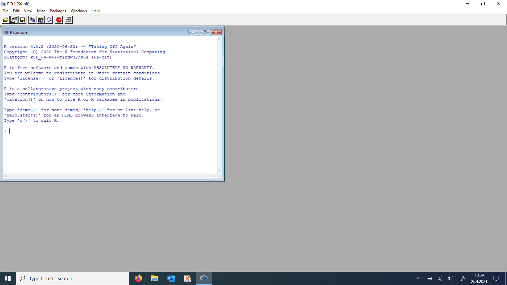
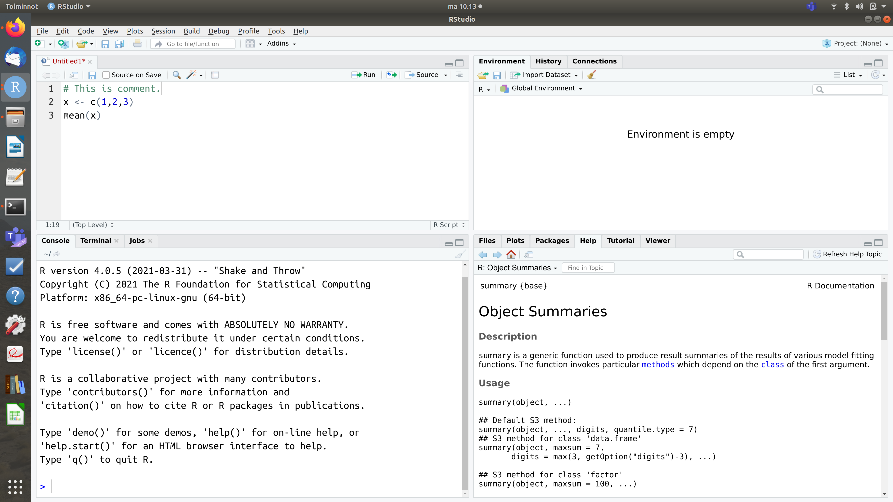

Introduction to R programming
========================================================
author: University Lecturer, PhD Juho Kopra
#date: -d.-m.2021
autosize: true

English translation of these slides by prof Merja Heinäniemi


Learning goals
========================================================
- In this course we will learn to program with the R programming language in order to perform basic data analysis
- After completing this course the student is able to:
    + explain the basic principles of R programming
    + conduct a basic analysis of a dataset using R, incl. formatting of the data and its description with plots and statistics 
    + search for information and documentation from the internet to support independent learning 

What can you do with R?
========================================================
- graphs and plots to describe a dataset
- calculate several statistics such as the descriptive statistics mean and variance 
- format a dataset
- save results
- perform complicated statistical data analysis and modeling
- perform optimization and simulation

What else?
- R-packages
- reports, books, presentations
- web pages

Why is it useful to study R?
========================================================
- R is a powerful tool for quantitative research
- scientific skills are relevant in many situations
    + Msc thesis, work life, PhD studies
- research and data analysis is performed using computers nowadays
    + with a computer software 
- R requires a bit more practice than standard software but is really versatile and useful for several tasks!
- R-skills are needed in statistics courses and many other studies 

Different R-programming environments
========================================================
left: 50%
- RGui


***
- RStudio

- R launched from terminal


RStudio introduction
========================================================


Simple arithmetic calculations with R
========================================================
left: 50%
- R can be used as a calculator

```r
1+6
```

```
[1] 7
```

```r
2-3
```

```
[1] -1
```

```r
2*3
```

```
[1] 6
```
***


```r
5/7
```

```
[1] 0.7142857
```

```r
4^2
```

```
[1] 16
```

Programming is giving instructions to a computer :
========================================================
- a program is a set of instructions (similar to a recipe)
- the order matters in the instructions!
  + eg. if you add the cucumber to the yoghurt before you have chopped/grated it, the result is not as you intended !

**Greek yoghurt dip recipe (Tzatsiki)**

1. Grate half a cucumber
2. Squeeze out the extra liquid from the grated cucumber
3. Peel and chop 1-2 garlic cloves
4. Mix the cucumber, garlic and spices into 0.5 litres of greek yoghurt
5. Let the mix collect flavor in the fridge for 20 minutes
6. Serve

Basics of programming:
========================================================
- R-code is a program that has been implemented in R language
- the code is run one command at a time starting from the top 
- R is a language so you need to know the words and grammar 


Basic tools
========================================================
left: 50%
- code is written using a code editor (RStudio)
- code can be run directly in the R-command prompt (console)
    + the symbol > in the console means that the prompt is ready to receive code (commands) 
    + the command prompt interprets the code (calculation) and returns the result 
    
    ***
    
- alternatively the code can be saved to a script file (with ending .R)
    + we will discuss this later
- R is an interpreted language which means that the program does not need to be complete or installed separately in order to use it. It can be run line by line. In this way, as R user you are directly communicating with the computer using R language.


Mistakes in code?
========================================================
left: 50%
- the computer understands only exactly correct commands so even one wrong character in the code will cause trouble! 
    + computers cannot interpret and guess what you mean if you refer to the same thing with different names for example

***

- problems can occur either when the program does not do what you intended it to do or running the code results in an error message 

```r
3 + "four"
```

```
Error in 3 + "four" : non-numeric argument to binary operator
```

How is code developed?
========================================================
1. If the code is long, plan code subsections
2. Start by writing a small part of code.
3. Test whether the code you wrote works.
4. If it does not work as intended, or results in an error message, find out what is the problem.
    + Which row in the code is resulting in the error message?
    + Which function or object causes the mistake/error?
5. Fix the code. (This could take a long time.)
6. Move to the next code segment and repeat from step 2 (in programming, repeating is also referred to as iteration)

What is the program code consisting of?
========================================================
- commands that contain:
- variables/objects (each has a name and a type)
- primitive data types and other object types
- functions 
- operations (performing some function such as comparison or value substitution)
- brackets and row changes
- comments


```r
x <- c(1,2,3)
mean(x) # calculate mean
```

```
[1] 2
```

Variables
========================================================
 - naming a variable (these can also be called objects)

```r
cats <- 3
dogs  <- 4
cats + dogs
```

```
[1] 7
```

```r
paste("My friend has",cats + dogs, "animals.")
```

```
[1] "My friend has 7 animals."
```
- the command can span many rows
    + in this case the command prompt marks the incompleteness with a + sign

```r
paste("My friend has",cats + dogs, "animals."
      )
```

```
[1] "My friend has 7 animals."
```

Variables
========================================================
left: 50%
- variable types

```r
class(cats)
```

```
[1] "numeric"
```

```r
# boolean variable
var_bool <- TRUE
var_bool
```

```
[1] TRUE
```

```r
class(var_bool)
```

```
[1] "logical"
```

***


```r
var_char <- "this is text"
class(var_char)
```

```
[1] "character"
```

Vectors
========================================================
 - from this point you can start Rcourse package part 1 


Conversion to a factor
========================================================
- variables can be categorical and in this case they can be referred to as factors 

```r
# numeric variable
var_num <- c(42.1,11.2,31)
class(var_num)
```

```
[1] "numeric"
```

```r
# factor variable (categorical)
var_fact <- factor(c(0,1,1,0,0))
class(var_fact)
```

```
[1] "factor"
```
- it is wise to convert a variable to a factor only when necessary (N.B. this is quite often the default way some R functions will handle categorical factors)

Functions
========================================================
 - we already used some functions (class, factor, mean)
 - we can also use the summary-funktion for different variable types

```r
summary(var_num)
```

```
   Min. 1st Qu.  Median    Mean 3rd Qu.    Max. 
  11.20   21.10   31.00   28.10   36.55   42.10 
```

```r
summary(var_fact)
```

```
0 1 
3 2 
```
 - notice here that the variable type can affect what the function does!

More about factors
========================================================
<font size="6">

```r
animals <- factor(c(0,1,1,0,0),labels=c("cat","dog"))
class(animals)
```

```
[1] "factor"
```

```r
summary(animals)
```

```
cat dog 
  3   2 
```

```r
animals <- factor(c("cat","dog","dog","cat","cat"))
class(animals)
```

```
[1] "factor"
```

```r
summary(animals)
```

```
cat dog 
  3   2 
```
</font>

Functions
========================================================
left: 50%
- part of the programming language functionality is contained in functions 
- funktions are based on the same basic concept as functions in mathematics 
    + R has several inbuilt functions

```r
exp(3) # eksponenttifunktio exp()
```

```
[1] 20.08554
```
- typically a function can take some **parameters** (input), also referred to as arguments

***

- funktions also often returns some values **return value** (output)
- when using a function it is important to understand what the function is supposed to do 
    + it is not necessary to know how the function has been implemented (written in code) 
- in R the function parameters do not always need to be mentioned (declared) which saves time in writing 
    + if it is not obvious what each input parameter values are specified, it is always a good idea to write the parameter name and the value for it, this makes the code easier to read 

Functions and data retrieval 
========================================================
- often it is important to find out what the function does using a help page or from internet  
    + help page can be opened in R by typing the question mark before the function name 
    
    ```r
    ?mean
    ```
    + many basic functions are decades old and for this reason the documentation might not be very easy to read (but it is accurate) perusfunktioista on vuosikymmeniä vanhoja, jonka takia dokumentaatio ei ole 
        + It is a good idea to refer to the Examples at the end of the documentation and then think whether you understand how the function works 
    + for the most common tasks you can also refer to the R Cheat Sheets, e.g.the base R cheat sheet [download here](https://www.rstudio.com/wp-content/uploads/2016/10/r-cheat-sheet-3.pdf)

Functions and data retrieval
========================================================
- if you do not know the function name, it is a good idea to perform a Google search (in English) to identify a suitable one
    + e.g. if you do not know how to calculate variance in R, go to  [Google](http://www.google.com) and search for: how to calculate variance in R
    + if you are searching for help in context of a specific package it is a good idea to add to the search "vignette"


Functions
========================================================
- some functions require many input parameters (arguments)

```r
seq(1,3,0.5)
```

```
[1] 1.0 1.5 2.0 2.5 3.0
```

```r
seq(from=1,to=3,by=0.5) # same but specifying each parameter by name
```

```
[1] 1.0 1.5 2.0 2.5 3.0
```

```r
seq(from=1,to=3,length.out=6) # by-argument not used, so here you need to name the length.out parameter 
```

```
[1] 1.0 1.4 1.8 2.2 2.6 3.0
```

Functions
========================================================
- function output can be saved to a variable 

```r
k <- seq(1,3,0.5)
k
```

```
[1] 1.0 1.5 2.0 2.5 3.0
```

Variables as parameters 
========================================================
left: 50%
- all the variables that are in memory (created during the R session you are running) can be used as function parameters (you can specify them with the equal sign "=")

```r
numbers <- c(1,2,3,4)
mean(x=numbers)
```

```
[1] 2.5
```
- or you can create the variable and set it as the function parameter directly 

```r
mean(x=c(1,2,3,4))
```

```
[1] 2.5
```
***
- the previous function calls are equivalent to 

```r
mean(numbers)
```

```
[1] 2.5
```
- it is not necessary to name the variable

```r
mean(c(1,2,3,4))
```

```
[1] 2.5
```


Operators
========================================================
 - operations to set parameter value <-, <<-, =

```r
x <- 5.2
y <<- 7.44 # rarely used
x2 = 5.3 # works but not recommended
```
 - these setting value operations do not return any value 
 - if you want to find out what the value of the variable is, you need to print the variable 

```r
x
```

```
[1] 5.2
```

```r
y
```

```
[1] 7.44
```

```r
x2
```

```
[1] 5.3
```
 
Operators
========================================================
left: 50%
 - comparison operators <=,<, ==, !=, >, >=

```r
3 <= 4 # is 3 smaller or equal to 4 ?
```

```
[1] TRUE
```

```r
5 < 4  # is 5 smaller than 4 ?
```

```
[1] FALSE
```

```r
3.01 == 3 # is 3.01 equal to 3 ?
```

```
[1] FALSE
```

***

```r
3 != 4 # is 3 not equal to 4?
```

```
[1] TRUE
```

```r
5 > 4  # is 5 smaller than 4 ?
```

```
[1] TRUE
```

```r
3 >= 4 # is 3 greater or equal to 4 ?
```

```
[1] FALSE
```
- Obs! The operator "=" cannot be used for comparison. Instead use two equal signs "=="

Comments
========================================================
- Comment in code is an explanation text that does not influence what the code does

```r
# The role of comments is to explain what the code does.
```
- We have already seen many comments, e.g. in the previous slide
    + Comments start with a #-sign followed by the explanation text
    + executable code can precede the #-sign

```r
x <- 1:10 # Create a vector with values from one to ten.
```
- A good comment is self-explanatory and tells in sufficient detail what the code does 
    + it is a good idea to write the comments in English

Comments
========================================================
- R has only one commenting sign (#)
    + some other programming languages have several
- It is good practice to start the code with a general description what it does and who wrote it 

```r
# R-programming: examples to students, Juho Kopra, University of Eastern Finland
```

- In addition at least the difficult part of the code are good to comment.
- In RStudio you can use the comment sign to split code into parts

```r
#-----------------------------------------------------
# new section of the code starts
```


Primitive data types and other data types
========================================================
- primitive data types include e.g. real or boolean values
- other data (object) types are derived from these and used to build the program 
- object types can store the primitive data type values 
- objects store information and can be used in different ways 

Primitive data types
========================================================
- In R **character, numeric, logical, integer, complex**
    + integer and complex types are seldom needed, we will not cover these.
- Primitive data types can serve as elements of other object types (esim. vector values).
- by importing R-packages it is possible to add more primitive and other data types for usage 

Some more words about primitive data types
========================================================
left: 50%
- **character** for strings
  
  ```r
  var_char <- "this is text"
  class(var_char)
  ```
  
  ```
  [1] "character"
  ```
- **numeric** for numbers
  
  ```r
  var_num <- c(42.1,11.2,31)
  class(var_num)
  ```
  
  ```
  [1] "numeric"
  ```
- **logical** for logical values
  
  ```r
  var_num <- c(TRUE,FALSE)
  class(var_num)
  ```
  
  ```
  [1] "logical"
  ```

***

- **integer**: not often needed
  
  ```r
  var_num <- c(0L,1L,5L)
  class(var_num)
  ```
  
  ```
  [1] "integer"
  ```
  
  ```r
  5L %/% 2L
  ```
  
  ```
  [1] 2
  ```
- **complex**: for calculating with complex numbers (not used in this course) 

Special values of primitive data types
========================================================
- NA specifies a missing value
    + can be used in context of any primitive data type
        + NA\_real\_, NA\_character\_, NA\_complex\_,
- Inf and -Inf specifying infitine numbers  1/0
    + only for numeric data types
- NaN specifies "Not a Number" 0/0
- these can be handled using functions is.na(), is.nan(), is.finite()
    
    ```r
    mean(c(1,2,NA),na.rm=TRUE)
    ```
    
    ```
    [1] 1.5
    ```
- NULL is a not specified value. Seldom needed.
    
    ```r
    x <- NULL
    is.null(x)
    ```
    
    ```
    [1] TRUE
    ```


Object types
========================================================
- Basic data types in R are **vector, data.frame, factor, list, matrix ja array**
    + the most important are vector, data.frame and factor
        + you will encounter them in almost all data analyses
    + also list and matrix data types are used
    + array is more rarely used

Vector
========================================================
- **vector** can be considered to represent a sequence of numbers
    + numbers are stored in the order as they were entered
    + each element must represent the same primitive data type
    + elements can have names

```r
values <- c(1.1,3.1,2.5)
text <- c("cat","dog","animal")
named_vector <- c("first"=1,"second"=2)
named_vector
```

```
 first second 
     1      2 
```

Dataframe
========================================================
- **data.frame** contains a dataset that can have variables (in columns) that represent different types 
    + each variable is a vector and these column vectors contain an equal number of elements
    + each variable has a name

```r
dat <- data.frame(values = c(1.1,3.1,2.5), text = c("cat","dog","animal"))
dat
```

```
  values   text
1    1.1    cat
2    3.1    dog
3    2.5 animal
```

List
========================================================
left: 50%
- **list** a list allows different object types to be stored 
    + list elements can have names but they do not need to 

```r
l <- list("a"=c(1,2),"b"=dat)
l
```

```
$a
[1] 1 2

$b
  values   text
1    1.1    cat
2    3.1    dog
3    2.5 animal
```

***

- list elements are referred to with double square brackets 

```r
l[[2]]
```
- a simple square bracket returns a list including a selected list element 

```r
l[2]
```

```
$b
  values   text
1    1.1    cat
2    3.1    dog
3    2.5 animal
```
    
A bit more about object types
========================================================
- **factor** we already encountered the factor type earlier
    + a factor is formed from a numeric or a character vector 
    + technically speaking a factor is a numerical vector where each value has a text label 

Matrix
========================================================
- **matrix** is a table that consists of only one primitive data type 
    + numeric matrices and vectors can be used to perform linear algebra, such as calculating a matrix product, transpose or inverse, or to find the eigenvalues.
    + a matrix is formed from vectors, by default by filling from left-most column vector 
    + it is possible to fill a matrix by row using the parameter  **byrow=TRUE**

```r
vec <- c(1,2,3,4,5,6)
matrix(vec,nrow=2,ncol=3)
```

```
     [,1] [,2] [,3]
[1,]    1    3    5
[2,]    2    4    6
```
    
