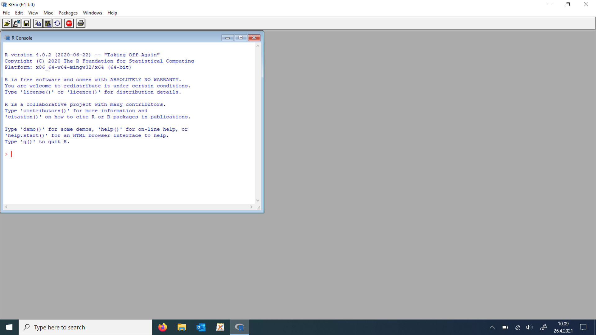
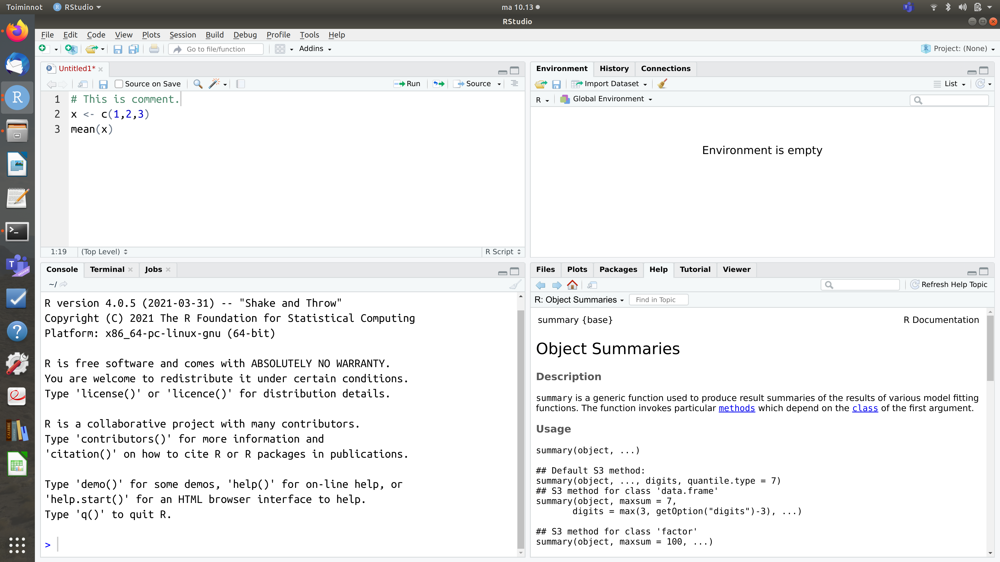

Johdanto R-ohjelmointiin
========================================================
author: Yliopistonlehtori, FT Juho Kopra
#date: 10.5.2021
autosize: true

Kurssin oppimistavoitteet
========================================================
- kurssilla opettelemme ohjelmoimaan R-kielellä sillä tasolla että kykenemme yksinkertaisiin tilastollisiin analyyseihin
- Opintojakson suoritettuaan opiskelija osaa:
    + selittää R-ohjelmoinnin oleelliset perusperiaatteet 
    + toteuttaa tavanomaisen tutkimusaineiston analyysin R-ohjelmoimalla ml. aineiston muokkaamisen, aineiston kuvailun kuvaajien ja tunnuslukujen avulla
    + hankkia tietoa käyttäen internetiä ja dokumentaatiosivuja itsenäisen opiskelun tukena

Mitä R:llä voi tehdä?
========================================================
- tilastografiikkaa, kuvaajia
- laskea mitä tahansa tunnuslukuja, kuten keskiarvon ja varianssin
- muokata aineistoa
- tallentaa tulokset
- toteuttaa monimutkaisiakin tilastollisia analyysejä
- optimointia, simulointia

Mitä muuta?
- R-paketteja
- raportteja, kirjoja, luentokalvoja
- verkkosivuja

Miksi R:ää kannattaa opiskella?
========================================================
- R on tehokas työkalu määrälliseen tutkimukseen
- tutkimusta tarvitaan monessa tilanteessa
    + opinnäyte, työelämä, jatko-opinnot
- tutkimusta ja data-analyysiä toteutetaan nykyään aina tietokoneen avulla
    + tietokoneella sitä tehdään jollain ohjelmalla
- R vaatii opettelua hieman muita ohjelmia enemmän, mutta taipuu todella moniin tarpeisiin!
- R-osaaminen on tarpeellista tilastotieteen ja muiden oppiaineiden kursseilla

Erilaisia R-ohjelmointiympäristöjä
========================================================
left: 50%
- RGui


***
- RStudio

- R komentorivillä käynnistettynä


RStudion esittely
========================================================


Laskeminen R:llä
========================================================
left: 50%
- R toimii laskukoneena

```r
1+6
```

```
[1] 7
```

```r
2-3
```

```
[1] -1
```

```r
2*3
```

```
[1] 6
```
***


```r
5/7
```

```
[1] 0.7142857
```

```r
4^2
```

```
[1] 16
```

Ohjelmointi on toimintaohjeiden antamista tietokoneelle:
========================================================
- ohjelma muodostuu toimintaohjeista (kuten resepti on toimintaohje)
- toimintaohjeiden järjestyksellä on merkitystä!
  + esim. jos jogurttiin lisää kurkun ennen kuin on raastanut sen, niin lopputulos ei ole haluttu!

**Kreikkalainen jogurttidippi (Tzatsiki)**

1. Raasta puolikas kurkku
2. Purista kurkkuraasteesta ylimääräinen neste pois
3. Kuori ja silppua 1-2 valkosipulin kynttä
4. Sekoita 0.5 litraan kreikkalaista jogurttia kurkku, valkosipuli ja mausteet
5. Anna maustua jääkaapissa 20 minuuttia
6. Tarjoile

Perusasioita ohjelmoinnista:
========================================================
- R-koodi on ohjelma, joka on toteutettu R-kielellä
- koodia suoritetaan komento kerrallaan ylhäältä alkaen, alaspäin edeten
- R on kieli, eli täytyy osata sen sanat ja kielioppi


Perustyökalut
========================================================
left: 50%
- koodia kirjoitetaan koodieditorilla (RStudio)
- koodia voidaan ajaa suoraan R-komentokehotteessa (console)
    + komentokehotteessa oleva väkänen > tarkoittaa, että komentokehote on valmis vastaanottamaan koodia (komentoja)
    + komentokehote tulkitsee koodin (laskutoimituksen) ja palauttaa lopputuloksen
    
***
- tai koodi voidaan tallentaa skriptitiedostoon (.R-päätteinen)
    + tähän palataan myöhemmin
- R on tulkattava kieli, mikä tarkoittaa että ohjelman ei tarvitse olla valmis, jotta sitä voidaan käyttää, vaan sitä voidaan suorittaa rivi kerrallaan. Käyttäjä siis keskustelee tietokoneen kanssa R-kielen avulla.

Aritmetiikkaa R:llä
========================================================


```r
1+6
```

```
[1] 7
```

```r
5/7
```

```
[1] 0.7142857
```

Virheitä koodissa?
========================================================
left: 50%
- tietokone ymmärtää vain täsmälleen oikein annettuja komentoja, joten yksikin väärä merkki koodissa aiheuttaa ongelmia!
    + tietokone ei osaa tulkita monimerkityksiä


***

- ongelma voi ilmetä joko siten että ohjelma ei tee mitä sen pitäisi tai ohjelman suorittaminen voi päättyä virheilmoitukseen

```r
3 + "four"
```

```
Error in 3 + "four" : non-numeric argument to binary operator
```

Miten koodia kehitetään?
========================================================
1. Jos koodi on pitkä, niin suunnittele koodin osaset
2. Aloita kirjoittamalla pieni pätkä koodia.
3. Kokeile, toimiiko kirjoittamasi koodi.
4. Jos ei toimi halutulla tavalla, tai tulee virheilmoitus, selvitä vian syy.
    + Millä rivillä virhe on koodissa?
    + Mikä funktio ja muuttuja aiheuttaa virheen?
5. Korjaa vika. (Tähän saattaa mennä paljonkin aikaa.)
6. Siirry seuraavaan koodin pätkään ja jatka iterointia kohdasta 2.

Mistä ohjelmakoodi muodostuu?
========================================================
- komennoista, jotka muodostuvat:
- muuttujista (muuttujien nimet ja tyypit)
- alkeistietotyypeistä ja tietotyypeistä
- funktioista 
- operaattoreista (tekevät jonkin toiminnon, kuten sijoitusoperaattori tai vertailuoperaattori)
- suluista ja rivinvaihdoista
- kommenteista


```r
x <- c(1,2,3)
mean(x) # lasketaan keskiarvo
```

```
[1] 2
```

Muuttujat
========================================================
 - muuttujan nimeäminen

```r
cats <- 3
dogs  <- 4
cats + dogs
```

```
[1] 7
```

```r
paste("My friend has",cats + dogs, "animals.")
```

```
[1] "My friend has 7 animals."
```
- komento voi mennä myös usealle riville
    + tällöin komentokehote ilmoittaa keskeneräisyydestä +-merkillä

```r
paste("My friend has",cats + dogs, "animals."
      )
```

```
[1] "My friend has 7 animals."
```

Muuttujat
========================================================
left: 50%
- muuttujien tyypit

```r
class(cats)
```

```
[1] "numeric"
```

```r
# boolean variable
var_bool <- TRUE
var_bool
```

```
[1] TRUE
```

```r
class(var_bool)
```

```
[1] "logical"
```

***


```r
var_char <- "this is text"
class(var_char)
```

```
[1] "character"
```

Vektorit
========================================================
 - tämä on sopiva kohta opettaa vektorit ja aloittaa Rcourse-paketin osio 1


Muuttujan muuttaminen faktoriksi
========================================================
- muuttujien mitta-asteikko voi olla myös kategorinen, jota sanotaan joskus faktoriksi (factor)

```r
# numeric variable
var_num <- c(42.1,11.2,31)
class(var_num)
```

```
[1] "numeric"
```

```r
# factor variable (categorical)
var_fact <- factor(c(0,1,1,0,0))
class(var_fact)
```

```
[1] "factor"
```
- muuttuja kannattaa muuttaa faktoriksi vasta kun on pakko

Funktiot
========================================================
 - olemme jo käyttäneet joitain funktiota (class, factor, mean)
 - käytetään summary-funktiota eri tyyppisiin muuttujiin

```r
summary(var_num)
```

```
   Min. 1st Qu.  Median    Mean 3rd Qu.    Max. 
  11.20   21.10   31.00   28.10   36.55   42.10 
```

```r
summary(var_fact)
```

```
0 1 
3 2 
```
 - muuttujan tyyppi voi siis vaikuttaa siihen, mitä funktio tekee!

Lisää faktoreista
========================================================
<font size="6">

```r
animals <- factor(c(0,1,1,0,0),labels=c("cat","dog"))
class(animals)
```

```
[1] "factor"
```

```r
summary(animals)
```

```
cat dog 
  3   2 
```

```r
animals <- factor(c("cat","dog","dog","cat","cat"))
class(animals)
```

```
[1] "factor"
```

```r
summary(animals)
```

```
cat dog 
  3   2 
```
</font>

Funktiot
========================================================
left: 50%
- osa ohjelmointikielen toiminnallisuuksista on funktioiden muodossa
- funktioilla on lähtökohtaisesti sama idea kuin funktioilla matematiikassa
    + R:ssä on valmiina lukuisia eri funktiota

```r
exp(3) # eksponenttifunktio exp()
```

```
[1] 20.08554
```
- yleensä funktio ottaa jotain tietoja **syötteenä** (input), joita sanotaan myös argumenteiksi

***

- funktio myös yleensä palauttaa jotain arvoja **palautusarvona** (output)
- funktioita käytettäessä on tarpeen ymmärtää mitä kyseinen funktio tekee
    + ei kuitenkaan tarvitse tietää miten ko. funktio on toteutettu
- R:ssä funktion argumentteja ei ole pakko aina mainita, mikä usein vähentää kirjoittamista
    + epäselvissä tilanteissa argumentit kannattaa kirjoittaa, se selkeyttää koodia

Funktiot ja tiedonhaku
========================================================
- usein on tarpeen selvitää funktion toiminnallisuus joko ohjesivun avulla tai internetistä 
    + ohjesivun saat R:ssä auki kirjoittamalla kysymysmerkin haluamasi funktion eteen
    
    ```r
    ?mean
    ```
    + monet perusfunktioista on vuosikymmeniä vanhoja, jonka takia dokumentaatio ei ole aina kovin helppolukuista (pitää silti paikkansa)
        + Dokumentaation lopussa oleva Examples kannattaa suorittaa ja pohtia ymmärtääkö miten funktio toimii
    + tavallisimpiin tarpeisiin on myös R Cheat Sheets, jotka ovat hyödyllisiä, esim. base R cheat sheet [lataa tästä](https://www.rstudio.com/wp-content/uploads/2016/10/r-cheat-sheet-3.pdf)

Funktiot ja tiedonhaku
========================================================
- jos et tiedä funktion nimeä, niin kannattaa etsiä englanninkielisellä Google-haulla sopivaa funktiota
    + esim. jos et tiedä miten varianssi lasketaan R:ssä, niin mene [Googleen](http://www.google.com) ja laita hakuun: how to calculate variance in R
    + mikäli etsit apua jonkin R-paketin käyttöön kannattaa lisätä hakusanaksi vignette


Funktiot
========================================================
- jotkut funktiot tarvitsevat useita argumentteja

```r
seq(1,3,0.5)
```

```
[1] 1.0 1.5 2.0 2.5 3.0
```

```r
seq(from=1,to=3,by=0.5) # sama, mutta argumentit nimetty
```

```
[1] 1.0 1.5 2.0 2.5 3.0
```

```r
seq(from=1,to=3,length.out=6) # by-argumenttia ei käytetä, joten on pakko nimetä length.out-argumentti
```

```
[1] 1.0 1.4 1.8 2.2 2.6 3.0
```

Funktiot
========================================================
- funktion palauttamat tiedot voi tallentaa suoraan muuttujaan

```r
k <- seq(1,3,0.5)
k
```

```
[1] 1.0 1.5 2.0 2.5 3.0
```

Muuttujat argumentteina
========================================================
left: 50%
- muistissa olevia muuttujia voi käyttää funktion argumentteina (operaattorina yhtäsuuruusmerkki "=")

```r
numbers <- c(1,2,3,4)
mean(x=numbers)
```

```
[1] 2.5
```
- tai muuttujan voi luoda suoraan sijoittaen se funktion argumentiksi

```r
mean(x=c(1,2,3,4))
```

```
[1] 2.5
```
***
- edelliset funktiokutsut ovat täsmälleen sama kuin 

```r
mean(numbers)
```

```
[1] 2.5
```
- ja (eli argumenttia ei ole pakko nimetä)

```r
mean(c(1,2,3,4))
```

```
[1] 2.5
```


Operaattorit
========================================================
 - sijoitusoperaattorit <-, <<-, =

```r
x <- 5.2
y <<- 7.44 #harvinainen, mutta Rcourse -paketti pyytää tätä joskus
x2 = 5.3 # toimii myös, mutta ei suositella
```
 - sijoitusoperaattoria käytettäessa arvoa ei palauteta
 - jos haluaa katsoa mitä tuli sijoitetuksi, on muuttuja itse tulostettava

```r
x
```

```
[1] 5.2
```

```r
y
```

```
[1] 7.44
```

```r
x2
```

```
[1] 5.3
```
 
Operaattorit
========================================================
left: 50%
 - vertailuoperaattorit <=,<, ==, !=, >, >=

```r
3 <= 4 # onko 3 pienempi tai yhtä suuri kuin 4 ?
```

```
[1] TRUE
```

```r
5 < 4  # onko 5 pienempi kuin 4 ?
```

```
[1] FALSE
```

```r
3.01 == 3 # onko 3.01 yhtä suuri kuin 3 ?
```

```
[1] FALSE
```

***

```r
3 != 4 # onko 3 eri suuri kuin 4?
```

```
[1] TRUE
```

```r
5 > 4  # onko 5 pienempi kuin 4 ?
```

```
[1] TRUE
```

```r
3 >= 4 # onko 3 suurempi tai yhtä suuri kuin 4 ?
```

```
[1] FALSE
```
- Huom! Sijoitusoperaattoria "=" ei voi käyttää vertailuun. Käytä sen sijaan kahta yhtäsuuruusmerkkiä "=="

Kommentit
========================================================
- Kommentti on koodissa oleva seliteteksti, joka ei vaikuta koodin toimintaan

```r
# Kommentin tarkoitus on kertoa, mitä koodi tekee.
```
- Olemme nähneet useita kommentteja, mm. edellisellä kalvolla
    + Kommentti alkaa #-merkillä ja seliteteksti tulee sen oikealle puolelle
    + ennen #-merkkiä voi olla suoritettavaa koodia

```r
x <- 1:10 # Create a vector with values from one to ten.
```
- Hyvä kommentti on yksiselitteinen ja selittää koodin toimintaa tarpeellisella tarkkuudella
    + jos arvelet, että joku ei-suomea puhuva henkilö voisi tarkastella koodiasi, niin kommentit ja muuttujien nimet kannattaa olla englanniksi

Kommentit
========================================================
- R:ssä on vain yksi kommenttimerkki, joka on risuaita (#)
    + joissain muissa ohjelmointikielissä on useita kommenttimerkkejä
- Yksi hyvä tapa on laittaa skriptin alkuun kommentti, mitä koodi yleisellä tasolla tekee ja kuka sen on tehnyt

```r
# R-programming: examples to students, Juho Kopra, University of Eastern Finland
```

- Lisäksi kannattaa kommentoida ainakin hankalasti ymmärrettävät kohdat koodista.
- RStudiossa voi kommenttimerkeillä lohkoa koodia osasiin

```r
#-----------------------------------------------------
# new section of the code starts
```


Alkeistietotyypit ja tietotyypit
========================================================
- alkeistietotyypit sisältävät ohjelmointikielen pienimmät osaset, kuten vaikkapa reaaliluvut tai totuusarvot
- tietotyypit ovat alkeistietotyypeistä johdettuja objekteja, joiden avulla ohjelman voi rakentaa
- tietotyyppeihin voidaan säilöä alkeistietotyyppien sisältämää dataa
- tietotyypit säilövät tietoa ja eri tietotyyppejä voidaan käyttää eri tavoin

Alkeistietotyypit
========================================================
- R:ssä alkeistietotyyppejä ovat **character, numeric, logical, integer, complex**
    + Tyyppejä integer ja complex tarvitaan vain harvoin, joten niitä ei käsitellä tällä kurssilla tarkemmin.
- Alkeistietotyypit voivat toimia muiden tietotyyppien elementteinä (esim. vektoreiden alkioina).
- ottamalla käyttöön R-paketteja, voidaan saada lisää alkeistietotyyppejä (ja tietotyyppejä) käyttöön

Hieman lisää alkeistietotyypeistä
========================================================
left: 50%
- **character** eli merkkijono
  
  ```r
  var_char <- "this is text"
  class(var_char)
  ```
  
  ```
  [1] "character"
  ```
- **numeric**
  
  ```r
  var_num <- c(42.1,11.2,31)
  class(var_num)
  ```
  
  ```
  [1] "numeric"
  ```
- **logical**
  
  ```r
  var_num <- c(TRUE,FALSE)
  class(var_num)
  ```
  
  ```
  [1] "logical"
  ```

***

- **integer**: ei yleensä tarpeellinen
  
  ```r
  var_num <- c(0L,1L,5L)
  class(var_num)
  ```
  
  ```
  [1] "integer"
  ```
  
  ```r
  5L %/% 2L
  ```
  
  ```
  [1] 2
  ```
- **complex**: kompleksilukujen laskemiseen. Emme käytä.

Alkeistietotyyppien erikoisarvot
========================================================
- NA eli puuttuva arvo
    + toimii kaikille alkeistietotyypeille
        + NA\_real\_, NA\_character\_, NA\_complex\_,
- Inf ja -Inf eli ääretön ja miinus ääretön esim. 1/0
    + vain numeeriselle tietotyypille
- NaN eli "Not a Number" 0/0
- voidaan käsitellä funktioilla is.na(), is.nan(), is.finite()
    
    ```r
    mean(c(1,2,NA),na.rm=TRUE)
    ```
    
    ```
    [1] 1.5
    ```
- NULL on määrittelemätön arvo. Harvoin tarpeellinen.
    
    ```r
    x <- NULL
    is.null(x)
    ```
    
    ```
    [1] TRUE
    ```


Tietotyypit
========================================================
- R:n perustietotyypit ovat **vector, data.frame, factor, list, matrix ja array**
    + näistä keskeisimmät ovat vector, data.frame ja factor
        + näitä tarvitaan lähes jokaisessa data-analyysissä
    + myös list ja matrix tietotyypeillä on oma käyttönsä
    + array on harvinaisempi tietotyyppi

Vektori
========================================================
- **vector** eli vektori, voidaan ajatella lukujonoksi
    + tallennetut luvut pysyvät oletusarvoisesti siinä järjestyksessä kuin ne on syötetty
    + elementtien on oltava samaa alkeistietotyyppiä
    + elementeillä voi olla jokin nimi

```r
values <- c(1.1,3.1,2.5)
text <- c("cat","dog","animal")
named_vector <- c("first"=1,"second"=2)
named_vector
```

```
 first second 
     1      2 
```

Datakehikko
========================================================
- **data.frame** datakehikko pitää sisällään aineiston, jossa voi olla eri tyyppisiä muuttujia
    + muuttujien on oltava vektoreita ja niissä on oltava yhtä monta elementtiä
    + muuttujilla on aina jokin nimi

```r
dat <- data.frame(values = c(1.1,3.1,2.5), text = c("cat","dog","animal"))
dat
```

```
  values   text
1    1.1    cat
2    3.1    dog
3    2.5 animal
```

Lista
========================================================
left: 50%
- **list** lista on luettelo, joka sallii eri tyyppisten objektien säilömisen
    + listan osioilla voi olla nimi, mutta ei ole pakko

```r
l <- list("a"=c(1,2),"b"=dat)
l
```

```
$a
[1] 1 2

$b
  values   text
1    1.1    cat
2    3.1    dog
3    2.5 animal
```

***

- listan alkioihin voi viitata kaksoishakasuluilla

```r
l[[2]]
```
- yksinkertainen hakasulku palauttaa listan, jossa valitut listan objektit

```r
l[2]
```

```
$b
  values   text
1    1.1    cat
2    3.1    dog
3    2.5 animal
```
    
Hieman lisää tietotyypeistä
========================================================
- **factor** faktori-tietotyyppiin tutustuimme jo aiemmin
    + faktori muodostetaan numeriisen tai tekstimuotoisen vektorin pohjalta
    + teknisesti faktori on tietokoneen muistissa numeerinen vektori, jonka lukuarvoille on selitetekstit (label)

Matriisi
========================================================
- **matrix** matriisi on taulukko, joka sisältää vain yhtä alkeistietotyyppiä
    + numeerisilla matriiseilla ja vektoreilla voidaan tehdä lineaarialgebraa, kuten matriisitulo (sisätulo/pistetulo), transpoosi, matriisin kääntäminen, jälki ja ominaisarvot.
    + matriisi muodostetaan vektorista, siten että oletusarvoisesti matriisi täytetään sarake kerrallaan alkaen vasemman puolisesta sarakkeesta
    + matriisin voi täyttää riveittäin argumentilla **byrow=TRUE**

```r
vec <- c(1,2,3,4,5,6)
matrix(vec,nrow=2,ncol=3)
```

```
     [,1] [,2] [,3]
[1,]    1    3    5
[2,]    2    4    6
```
    
